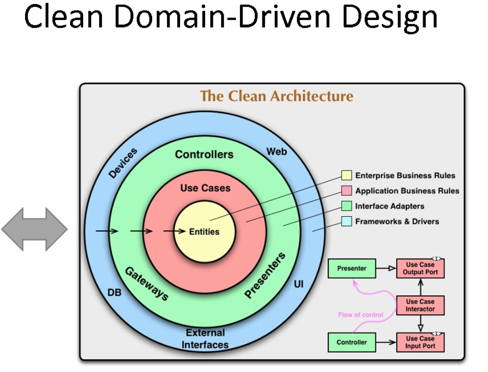
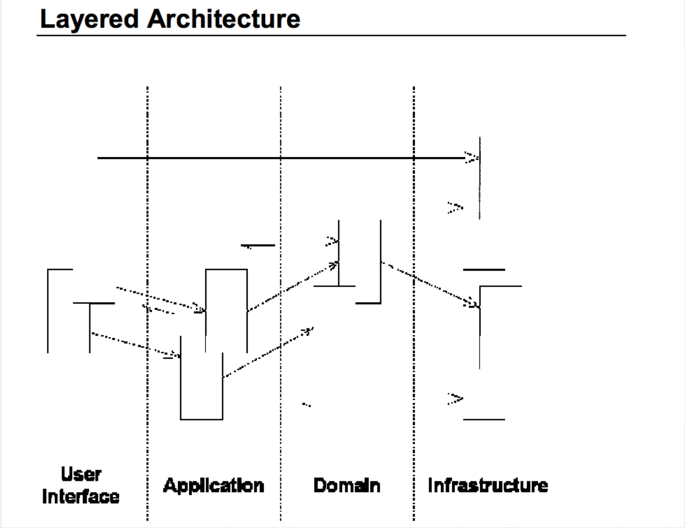

## overview(external) architecture


## overview(internal) architecture


---

## How to use:
- You will need .NET SDK 6.0
- The latest SDK and tools can be downloaded from https://dot.net/core.

Also you can run the  in Visual Studio Code (Windows, Linux or MacOS).

To know more about how to setup your enviroment visit the [Microsoft .NET Download Guide](https://www.microsoft.com/net/download)

## How to setup via local:

```sh
$ docker run -d -p 15672:15672 -p 5672:5672 rabbitmq:3.8.14-management
$ docker run -d -p 27017:27017 --name test-mongo mongo:latest
$ dotnet run
$ open http://localhost:5000/swagger
```


## How to setup via docker compose:

```sh
$ docker-compose build
$ docker-compose up
$ open http://localhost:8002/swagger
```
For stop all containers
```sh
$ docker-compose down
```

## Technologies implemented:

- [x] dockerize
- [x] docker compose
- [x] structed logging + elasticsearch
- [x] global exception handling
- [x] usecases
- [x] unit tests
- [x] rest
- [x] mediatR
- [x] clean architecture
- [x] mongo
- [x] masstransit
- [x] rabbitmq
- [x] dotnet6.0


